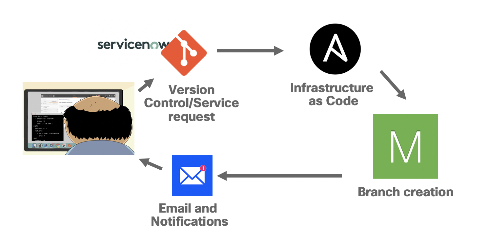
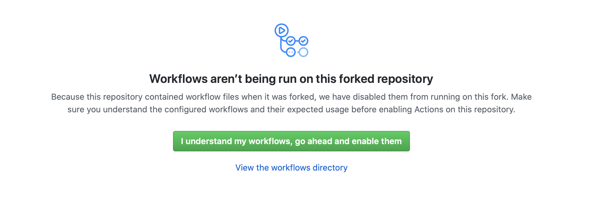

# NetDevOps with Ansible + Meraki + Github Actions 

When it comes to enterprise IT more and more organisations are looking to standardise their tooling for the configuration and management of these networks. An increasingly popular tool is the use of Ansible as part of a wider service chain to standardise what deployments look like across multiple different vendors and platforms.

In this short guide I will be showing how we can use Ansible and Cisco Meraki to automate the deployment of branches in the Meraki platform all the way from the creation of networks, claiming of devices, binding of network templates and updating network specific details. This integration could also include a ITSM system such as ServiceNow or Jira which would have a handoff to Ansible to generate a data structure such as a CSV or YAML file which Ansible will use to create the network configuration in our examples. However in this exampel we'll create the YAML files manually for simplicity, but keep in mind that an ITSM would likely kick the process off.

This kind of usecase is suitable for any kind of environment where branch networks are likely to be simple in design but the numbers of actual physical locations could go into the thousands and the challenge sits in the deployment. It’s typically not feasible to have a dedicated network professional visit each location to carry out the install. With this kind of solution the deployment can be a mostly physical job where all thats required it to plug in the cables and test connectivity as much of the deployment will have been done before the infrastructure even arrives at its destination. With this workflow we’re able to automate the whole logical deployment with a single playbook that can be triggered through a CI pipeline or ITSM ticket/request. This is known in networking as NetDevOps.

```Please note: This repo is intended for a demonstration and is not a 'production ready' CICD/NetDevOps pipeline tha can be deployed, they're are parts of this project that are missing such as network testing and robustness improvements that should be made before this would be suitable for production.```

## The NetDevOps workflow

How this would actually be implemented in an organisation will differ the handover to the networking configuration here could happen and different points of the service chain. Some possible triggers for this playbook could include:

* CSV/YAML files generated by an ITSM system as the result of a service request, eg ServiceNow, Jira
* Configuration files per network built and commited to a source control system, kicking off a CICD process
* Part of an Ansible Tower workflow

In this example we'll be showing how we use a YAML file with the required details for our networks and devices this will populate the playbook we've build and allow it to run carrying out all the tasks required to set up the networks. For a full breakdown of the tasks in the playbook skip ahead to the 'playbook walkthrough' section.



One of the things that makes this such a simple workflow is the Meraki platform, which provides us two main benefits here that are quite unique. Firstly Meraki supports ZTP natively therefore will allow the devices to call home as soon as they receive an internet connection aslong as their serial number has been registered to an organisation, which we do in our playbook. This will then allow the devices to pull down a config thats already been set well in advance and we don’t have to rely on our playbook getting individual device connectivity, the dashboard has the device configs already applied waiting for the device to announce itself.

Secondly the way Meraki supports templates for network configuration allows us to abstract away much of the manual configuration in our playbook and automate much of the deployment simply by attaching a template. All we have to do is build a few custom tasks for firewall rules and IP Addressing which is specific to our branch. Meraki will do tasks like VLAN assignment, port security, SSID creation all for us.

## CICD - Continuous Integration, Continuous Delivery. But for networks

As we've demonstrated in our network above this could form part of a CICD pipeline to automate the deployment of branches. This is known as NetDevOps. The devices and network elements can be defined through a YAML file like the example below, you could refer to this as 'infrastructure as code' as our infrastructure is being defined by these YAML files. As new files are added to the source control for each branch we can automate CICD functionality (e.g. Gitlab CICD or Github actions) to automatically run the the playbook and deploy our branches.

In this scenario we can define the devices to be added to our network and the template to be bound from our YAML file definition. Like the below example where we define 4 devices to be added to the network, the Ansible playbook will read these files (included in the repo) and use the variables to carry out the required tasks in the playbook. Should you wish to add more or less devices to your network you just need to edit the YAML file with the appropriate number of devices.

```yaml
---
 device-1:
    network_name: Branch-1321
    template_name: Branch-Template-Small
    device_name: br_1321_mx1
    device_type: MX67C-WW
    serial_no: XXXX-XXXX-XXXX
    vlan_id: 1

 device-2:
    network_name: Branch-1321
    template_name: Branch-Template-Small
    device_name: br_1321_sw1
    device_type: MS120-8LP
    serial_no: XXXX-XXXX-XXXX
    vlan_id: 1

 device-3:
    network_name: Branch-1321
    template_name: Branch-Template-Small
    device_name: br_1321_ap1
    device_type: MR70
    serial_no: XXXX-XXXX-XXXX
    vlan_id: 1

 device-4:
    network_name: Branch-1321
    template_name: Branch-Template-Small
    device_name: br_1321_ap2
    device_type: MR70
    serial_no: XXXX-XXXX-XXXX
    vlan_id: 1

```

In this scenario we're also outlining the IP addressing and subnets through an accompanying YAML file. As can be seen below, these override the VLANs for the network which the original template defines. Please note, if you do not have the correct number of subjects and the names aren't correct for your corresponding template this is likely to fail. Make sure you have the same number of networks you're going to define in your YAML files and they have the same names too.

```yaml
---
 subnet-1:
    network_name: Branch-1321
    template_name: Branch-Template-Small
    name: VLAN_management
    vlan_id: 1
    subnet: 10.0.0.0/24
    default_gw: 10.0.00.1
    
 subnet-2:
    network_name: Branch-1321
    template_name: Branch-Template-Small
    name: VLAN_Payments
    vlan_id: 100
    subnet: 192.168.10.0/29
    default_gw: 192.168.10.1

 subnet-3:
    network_name: Branch-1321
    template_name: Branch-Template-Small
    name: VLAN_Corp
    vlan_id: 101
    subnet: 10.20.0.0/24
    default_gw: 10.20.0.1
```

## Prerequsites

To fully replicate this guide you will need a Meraki network which isn't something we can quickly spin up through virtual means such as DevNet sandboxes. However if you have a Meraki device, it's possible to replicate quite easily by building up your own YAML datastructures to meet the devices you have, the template you wish to deploy and he IP addressing for your environment.

You will need a machine with Ansible installed, a basic working knowledge of Ansible is preferred for this guide. Please see the following repositories which also cover Ansible:

* [Getting started with Ansible](https://github.com/sttrayno/Ansible-Lab-Guide)
* [Deploying ASAv in AWS with Ansible](https://github.com/sttrayno/ASAonAWS-Ansible-Deployment)

This isn't a beginners guide to Ansible so I woiuld recommend getting the basics of Ansible first before diving into this.

***If you are going to follow this guide you should create a fork of this repo as you'll need to work with the playbooks and vars files included in this repo, if you're going to be working with your own devices and serial numbers you should consider making this private to make it private***

## Ansible CLI

But first we're not going to jump into the deep end by building a full NetDevOps pipeline right away, lets build our knowledge up with Ansible and Meraki to dip our toe in the water first.

One of the most straight forward ways to get started with Ansible and Meraki is by running playbooks directly from the CLI. Whilst not a fully automated process this will give some level of automating the majority of the work and demonstrating how Ansible can be used. In this guide we won't discuss the individual modules here [here](https://github.com/ansible/community/wiki/Network:-Meraki) and [here](https://docs.ansible.com/ansible/latest/scenario_guides/guide_meraki.html#ms-switches) with an honourable mention to [this repo here](https://github.com/shrunbr/ansible-provision-meraki) which has some excelent playbook examples if you're just getting started.

In this first exercise we'll run the playbook with Ansible driven from the CLI first to get familiar with the Meraki modules and the Ansible workflow

### Breakdown of playbook

In this repository under the folder playbook you can see our example Playbook which we will use here. 

The first two tasks read the files '[addresses.yaml](https://github.com/sttrayno/Meraki-Ansible-Deployment/blob/master/playbooks/addresses.yaml)' and '[devices.yaml](https://github.com/sttrayno/Meraki-Ansible-Deployment/blob/master/playbooks/devices.yaml)' and stores the contents in variables to be used in the later tasks. Have a look at both files in the /playbooks folder of this repository you'll see how they are laid out.

```
IMPORTANT: Within the devices.yaml file please ensure that your serial number matches your devices you're going to deploy, in the master repo they are marked as XXXX-XXXX-XXXX
````

The third task creates the network within the Meraki Dashboard for us to use in the following steps.

The fourth task then goes on to loop through the devices.yaml file and add all devices defined to our newly created network from the previous task. This uses the serial numbers for each device which is defined in the YAML file

The firth task updaes the devices we added in the previous task with attribues such as names, IP addresses etc.

The sixth binds a template to our newly created network, this is one of the advantages of the Meraki platform, we don't have to configure each individual setting with the API and can instead bind a predefined template to our network. Just make sure your template that you define in the devices.yaml file actually exists or the playbook will fail

The seventh and final task then updates the IP addressing with the exact specific subnets that are required for that network. When you bind a template one of the default behaviours is to use the same IP subnets for each subnet and NAT or to have Meraki automatically assign a free subnet from a predefined pool. Neither of these are ideal for an enteprise so we need to overwrite the default IP settings with our own subnets from the addressing.yaml file. If this isn't an issue for you and the default behavour for Meraki is ok then remove this task.

```yaml
---
- name: Meraki Deployment
  hosts: localhost
  vars:
    auth_key: "{{ auth }}"
    org_name: "{{ org }}"

  tasks:

    - name: include variables for devices
      include_vars:
        file: devices.yaml
        name: devices

    - name: include variables for addresses
      include_vars:
        file: addresses.yaml
        name: addresses

    - name: Create site network
      meraki_network:
        auth_key: "{{ auth_key }}"
        state: present
        org_name: "{{ org_name }}"
        name: "{{ item.value.network_name }}"
        type:
          - switch
          - appliance
          - wireless
      register: off_network
      loop: "{{ lookup('dict', devices) }}"
      when: "'device-1' in item.key"

    - name: Add devices to Network
      meraki_device:
        auth_key: "{{ auth_key }}"
        org_name: "{{ org_name }}"
        net_id: "{{ off_network.results.0.data.id }}"
        state: present
        serial: "{{ item.value.serial_no }}"
      register: off_add_dev1
      loop: "{{ lookup('dict', devices) }}"

    - name: Update device Information
      meraki_device:
        auth_key: "{{ auth_key }}"
        org_name: "{{ org_name }}"
        net_id: "{{ off_network.results.0.data.id }}"
        state: present
        serial: "{{ item.value.serial_no }}"
        name: " {{ item.value.device_name }}"
        move_map_marker: no
      register: off_update_dev1
      loop: "{{ lookup('dict', devices) }}"


    - name: Bind a template from a network
      meraki_config_template:
        auth_key: "{{ auth_key }}"
        state: present
        org_name: "{{ org_name }}"
        net_name: "{{ item.value.network_name }}"
        config_template: "{{ item.value.template_name }}"
      delegate_to: localhost
      loop: "{{ lookup('dict', devices) }}"
      when: "'device-1' in item.key"

    - name: Add subnets
      meraki_vlan:
        auth_key: "{{ auth_key }}"
        org_name: "{{ org_name }}"
        net_id: "{{ off_network.results.0.data.id}}"
        state: present
        name: "{{ item.value.name }}"
        vlan_id: "{{ item.value.vlan_id }}"
        subnet: "{{ item.value.subnet }}"
        appliance_ip: "{{ item.value.default_gw }}"
      loop: "{{ lookup('dict', addresses) }}"

```

This script could be customised to meet your exact deployment needs however the above can serve as an example. 

```IMPORTANT: Please make sure you add your API key for Meraki and Organsation name into lines 5 and 6 of the playbook above or add them in when running the playbook as we do in the next section```

### Running playbook

All thats left to do is now lets run the playbook, to do this manually this can be done simply with the command executed on your local workstation. If you've manually hardcoded the auth and org details for Merki in your playbook then you can run the below. While this playbook runs explore your Meraki dashboard to see the resources being created within Meraki.

```
ansible-playbook deploy-branch-readyaml.yaml
```

If you've edited the playbook to manually hardcode the auth and org details for Merki in your playbook then you can run the below. Otherwise you can add them in at runtime like so.

```
ansible-playbook deploy-branch-readyaml.yaml --extra-vars "auth=<YOUR API TOKEN HERE> org=<YOUR ORG NAME HERE>"
```

The playbook will execute as per the animation below and create the required resources in the Meraki dashboard which you can now verify by going to the Meraki dashboard and examining the networks, devices, subnets etc.


Congratulations, you've deployed your first Meraki network wih Ansible. Now in the next sections we're going to take that to the next level and start to automate even the running of our playbook.

## Automate deployment with Github Actions

A more preferred option may be to automate this deployment process with a CICD pipeline. In 2019, Ansible introduced their actions feature which allows for users to create their own CICD pipelines which allow for actions to be taken upon certain events from playbooks such as a push, pull, merge etc. In this section we'll go onto examine this feature and how it can be used to create a pipeline for deploying Meraki networks. You can learn more about Github actions from the [documentation](https://help.github.com/en/actions) which is fairly comprehensive. 

### Github Actions

Building a pipeline couldn't be simplier, after clicking the actions tab you should see many options for building your own pipelines which are 'prebuilt'. Ignore these for now and select "set up a workflow yourself". Once selected this should give a blank text editor which you can paste the below in. Alternatively you can fork this repo and get the .github/workflows/main.yaml file in your repo already. The following sections will go onto examine this pipeline you've just created.

Should you have forked this repo simply click on actions and confrim that you have understood the workflows, the pipeline will be set up for you and be kicked off anytime a file is changed in the vars folder. Before you do this though it's good practice to read the rest of this section to understand the Github actions functionality a little better.



```yaml
name: CICD  

on:
  push:
    branches: 
      - master
    paths:
      - 'playbooks/vars/**'

jobs:
  lint:

    runs-on: ubuntu-latest

    steps:
    # Important: This sets up your GITHUB_WORKSPACE environment variable
    - uses: actions/checkout@v2
     
    - name: Lint Ansible Playbook
      # replace "master" with any valid ref
      uses: ansible/ansible-lint-action@master
      with:
        targets: |
           playbooks/deploy-branch-readyaml.yaml
        override-deps: |
          ansible==2.8
          ansible-lint==4.2.0
        
    - shell: bash
      env:
        auth: ${{ secrets.MERAKIAPI }}
      run: sh ./scripts/entrypoint.sh
```

### Secrets

One of the biggest challenges in any kind of network automation is treating secrets such as API keys and passwords correctly and not sharing them

Luckily, Github actions solves this by allowing you to create secret variables for a repo which can be loaded in at runtime. Go to your repo settings and create a variable called "MERAKIAPI". As you can see below in the last action of our playbook we end up loading this as an environment variable called 'auth' which your shell script that calls the Ansible playbook runs.


This secret is then passed into our pipeline at runtime with the below commands, it's stored as a shell environment variable and passed to Ansible which is called by the shell script 'entrypoint.sh'. You can examine this by going to the scripts folder and looking at the script for yourself

```yaml
    - shell: bash
      env:
        auth: ${{ secrets.MERAKIAPI }}
      run: sh ./scripts/entrypoint.sh
```

### Running / Triggers

Now all that's left to do is get things running, the on: section of your file defines when this pipeline will run. The below denotes that anytime (this means we can have a separte branch for testing without impacting production). The paths section denotes that only when a file in the playbooks/vars folder is changed or added to that the actions will be started.

```yaml
name: CICD-Meraki

on:
  push:
    branches: 
      - master
    paths:
      - 'playbooks/vars/**'
```

For example in the below graphics you can see a new folder being commited to the repo. As soon as the address.yaml / device.yaml are commited to vars/branch-996 the actions are kicked off from within our repo and the process for deploying the networks is well underway within a few minutes.


*Commiting to the repo*


*Pipeline has been started*

In a realistic example this may be deployed to a test branch first, which once tested would then be merged with the master to kick off the changes in production however this is just an illustration and not intended to be ready for production.

Once the actions are complete you can then check the Meraki dashboard to see your networks have been created as was specified in the yaml definition files added to the repo. Should you add another folder into the the playbooks/vars directory which containers addresses.yaml and devices.yaml the pipeline will be kicked off again to deploy the new branch.


*Verifying pipeline has complete sucessfully in the Meraki dashboard*

Congratulations, you should show have a NetDevOps pipeline set up for your Meraki branches. This is not intended to be a full production but a demonstrator as to how you could use Ansible with a Meraki network. If you have any feedback or issues with this guide, please get in contact with me at sttrayno@cisco.com or raise an issue in this repo.

